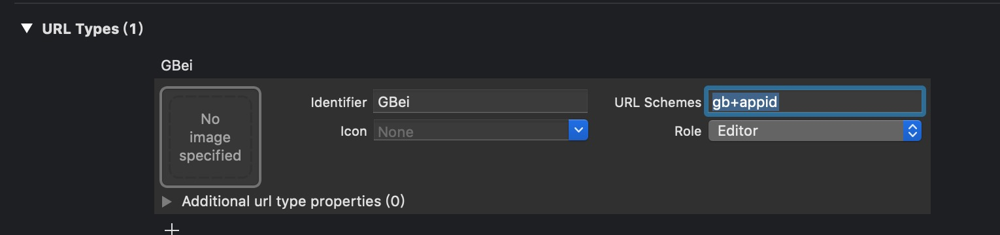

# GBeiSDK使用指南

[](https://travis-ci.org/gbeicom/GBeiSDK)
[](https://cocoapods.org/pods/GBeiSDK)
[](https://cocoapods.org/pods/GBeiSDK)
[](https://cocoapods.org/pods/GBeiSDK)

## 样例 

github 上有使用[demo](https://github.com/gbeicom/GBeiSDK.git)

## 安装方式

Pod

```ruby
pod 'GBeiSDK'
```


## 使用方式

1.添加白名单 gbei 


2.添加 URL type 格式为 gb+appid




3.注册 appid 和 appkey，处理回调

```
- (BOOL)application:(UIApplication *)application didFinishLaunchingWithOptions:(NSDictionary *)launchOptions
{
    [[GBOAuth shared] setupAccountWithappID:GBAPPID appKey:GBAPPKEY];

    return YES;
}


-(BOOL)application:(UIApplication *)app openURL:(NSURL *)url options:(NSDictionary<UIApplicationOpenURLOptionsKey,id> *)options{
    
     if ([GBOAuth handleOpenURL:url] ) {
        return YES;
    }
    
    return YES;
}

```


4.发起授权请求

```
#pragma mark ---京贝尔登录
-(void)gbeiClick:(UIButton *)btton{
    [GBOAuth oauth:^(NSString * _Nonnull code, NSError * _Nonnull error) {
        // 获取code
        NSInteger errcode = error.code;
        if (errcode == -1) {
            NSLog(@"-----error-------\n%@", error.domain);
        } else {
            [self gbeiLogin:code];
        }
    }];
}


-(void)gbeiLogin:(NSString *) code {
    NSLog(@"返回code %@", code);
}

```


## Author

gbeicom, 1055004344@qq.com

## License

GBeiSDK is available under the MIT license. See the LICENSE file for more info.
